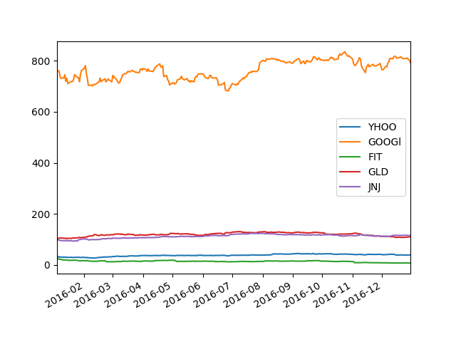
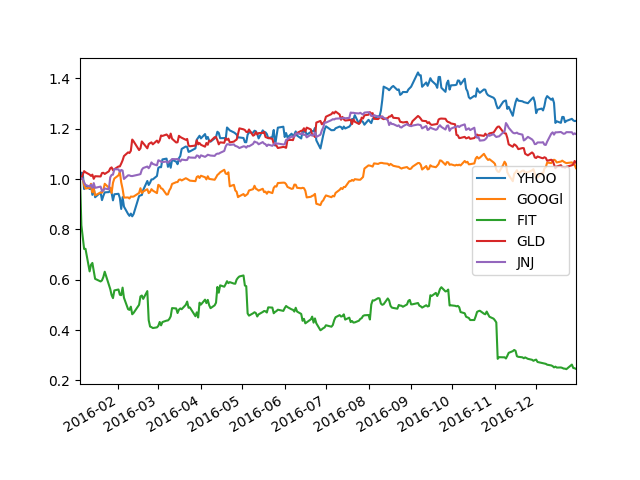

# portolio

Will be a financial portfolio optimizer.

## Tasks:

* Read stock prices from yahoo finance given a list of stock symbols.
* Plot their price from the given start date to end date.
* Option to normalize price.

## Usage
```bash
$ portolio -h
usage: portolio [-h] [-v] [-n] start_date end_date symbol [symbol ...]

Portolio is a portfolio optimizer.

positional arguments:
  start_date       start date
  end_date         end date
  symbol           stock symbols in the portfolio

optional arguments:
  -h, --help       show this help message and exit
  -v, --version    show program version number and exit
  -n, --normalize  normalize stock prices
```

#### Plots stock prices 
```bash
$ portolio 2016-01-02 2017-01-01 YHOO GOOGl FIT GLD JNJ
```



#### Plots normalized prices 
```bash
$ portolio -n 2016-01-02 2017-01-01 YHOO GOOGl FIT GLD JNJ
```


